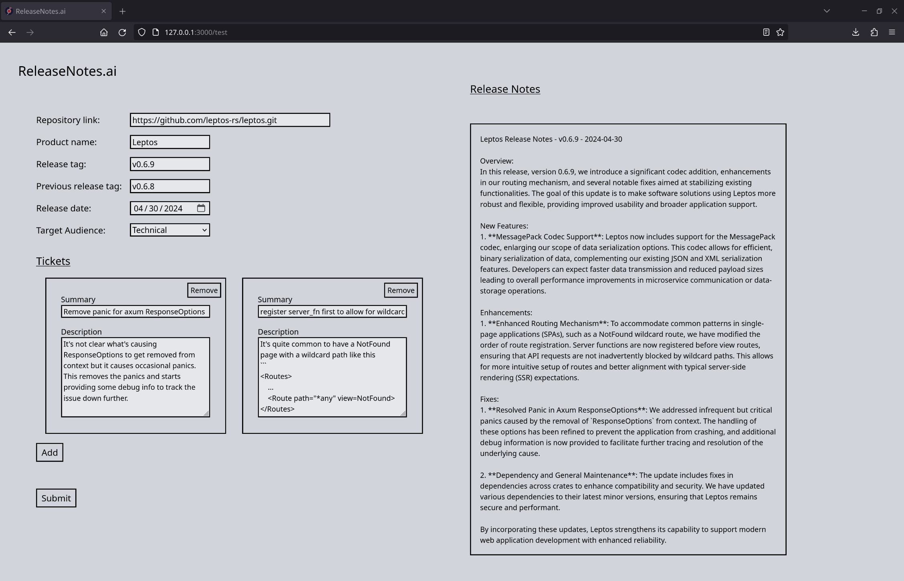

# ReleaseNotes.ai

Generates release notes for a product from git commit log and associated artifacts. Release notes can be prepared with 3 types of users: non-technical customers, project managers, technical teams.



## Setup
Run:
- `cargo install cargo-leptos`
- `cargo leptos build --release`
- `OPENAI_API_KEY=<api key> ./target/release/releasenotes`

## Service 
Accessible via http://127.0.0.1:3000 and http://127.0.0.1:3000/test. The latter loads with a non-trivial example specified in ./src/templates/test-arguments.json.

### Input
- Repository URL
- Last release tag
- Target release tag
- Tickets
- Audience: Customer, Project Managers, Engineering/IT/QA

### Output
```template
[Product Name] Release Notes - [Version Number] - [Release Date]
Overview:

[summary: Provide a brief overview of the release, highlighting the main features, enhancements, and fixes included.]

New Features:

[Feature 1]: Description of the new feature and its functionality.
[Feature 2]: Description of the new feature and its functionality.


Enhancements:

[Enhancement 1]: Description of the enhancement and how it improves user experience or performance.
[Enhancement 2]: Description of the enhancement and how it improves user experience or performance.


Fixes:
[Fix 1]: Description of the issue that was fixed and how it was resolved.
[Fix 2]: Description of the issue that was fixed and how it was resolved.

```

## Tech Stack
### Axum
Axum is the Rust equivalent of Express and provides routing.
- The frontend communicates with the backend through a single websocket exposed on `/submit`.
- The backend communicates with the OpenAI API through HTTP server side events. This allows for streaming tokens to the client as soon as the initial tokens are ready.
### Leptos
Leptos is the Rust webassembly equivalent to SolidJS (like React with its reactive programming but with more granular and efficient management of the DOM). This codebase uses Leptos server components (analagous to NextJS) for quick initial loading time.
### LibGit2
I use the Rust bindings to libgit2. This is superior to creating git subprocesses due to type safety and performance.